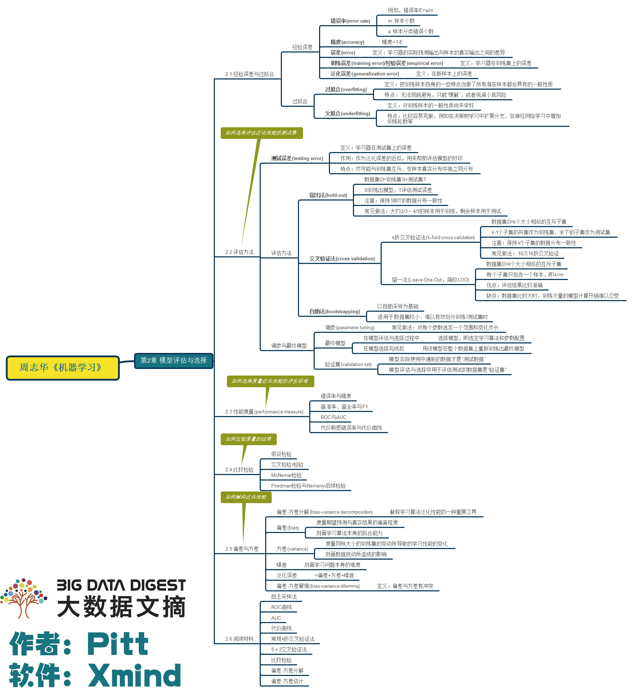
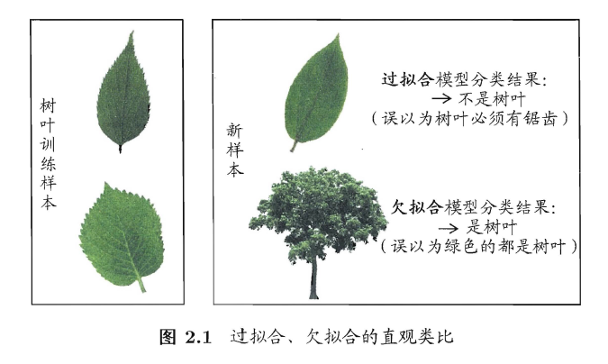
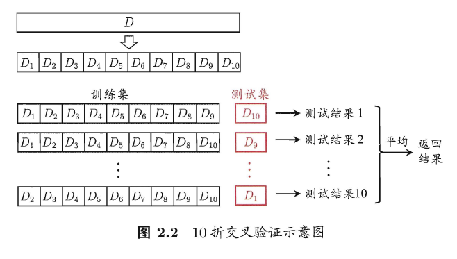
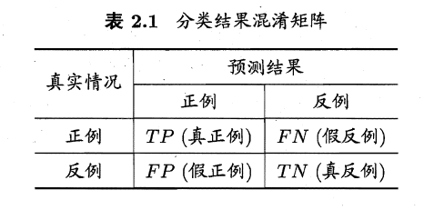
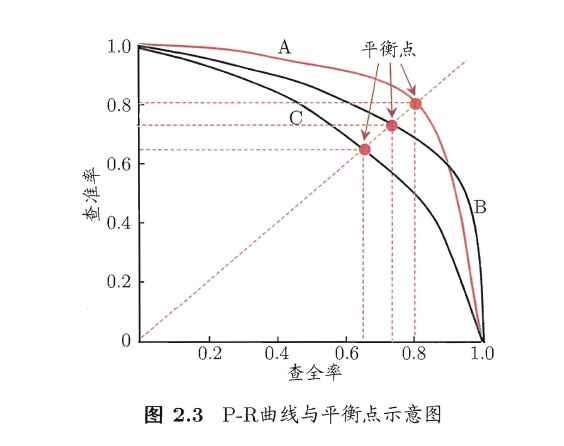
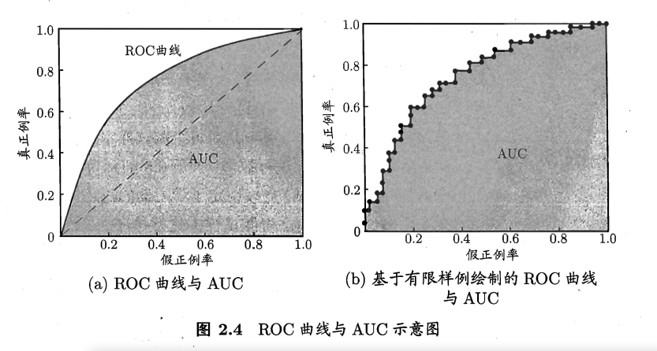
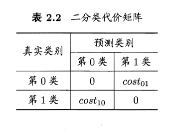
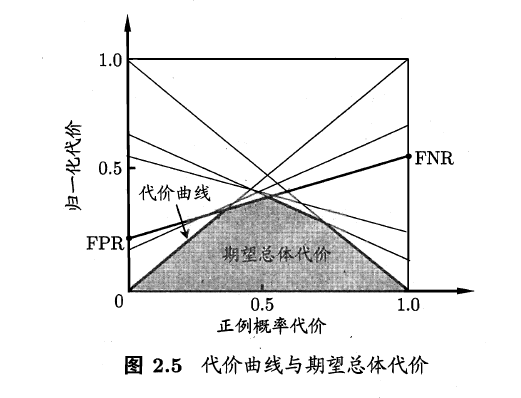

# 第2章 模型评估与选择

## 经验误差与过拟合

学习器在训练集上的误差称为“**训练误差**”（training error）或“**经验误差**”（empirical error），在新样本上的误差称为“**泛化误差**”（generalization error）。

> 目的：我们希望得到泛化误差小的学习器。

##### 过拟合

学习器在训练样本上学习得“太好了”，很可能把训练样本自身的一些特点当作了所有潜在样本都具有的一般性质，这样导致泛化性能下降，这种现象称为**过拟合**（overfitting）。

##### 欠拟合

学习器经过训练后，在测试集上并没有取得很好的拟合效果，这种现象称为**欠拟合**（underfitting）。

> 欠拟合比较容易克服；造成过拟合的因素可能是多种多样的。

## 评估方法

### 留出法

**留出法**（hold-out）直接将数据集$D$划分为两个互斥的集合，其中一个作为训练集$S$，另一个作为测试集$T$，即$D=S \cup T, S \cap T=\varnothing$。

> 需要注意，训练/测试集的划分要尽可能保持数据分布的一致性；

### 交叉验证法

**交叉验证法**（cross validation）先将数据集$D$划分为$k$个大小相似的互斥子集，即$D=D_{1} \cup D_{2} \cup \ldots \cup D_{k}, D_{i} \cap D_{j}=\varnothing(i \neq j)$。每个子集$D_i$都尽可能保持数据分布的一致性，即从$D$中通过分层采样得到。然后，每次用$k-1$个子集的并集作为训练集，余下的那个子集作为测试集；这样就可以获得$k$组训练/测试集，从而可进行$k$次训练和测试，最终返回的是这$k$个测试结果的均值。交叉验证法苹果结果的稳定性和保真性在很大程度上取决于$k$的取值，通常把交叉验证法称为**$k$折交叉验证**（$k$-fold cross validation）。

> 假设数据集$D$中包含$m$个样本，若令$k = m$，则可得到交叉验证的一个特例：**留一法**（Leave-One-Out，简称LOO）。虽然留一法评估比较准确，但当数据集很大时，模型的计算开销时巨大的。

### 自助法

**自助法**（bootstrapping）以自助采样法（bootstrap sampling）为基础，给定包含m个样本的数据集$D$，对它进行采样产生数据集$D^{\prime}$：每次随机从$D$中挑选一个样本，将其拷贝放入$D^\prime$，然后再将该样本放回初始数据集$D$中，是的该样本在下次采样时仍有可能被采集；这个过程重复执行$m$次，既可得到数据集$D^\prime$。

### 调参与最终模型

## 性能度量

对学习器的泛化性能进行评估，不仅需要有效可行的实验估计方法，还需要有衡量模型泛化能力的评价指标，这就是性能度量。

回归任务最常用的性能度量是**均方误差**（mean squared error）
$$
E(f ; D)=\frac{1}{m} \sum_{i=1}^{m}\left(f\left(\boldsymbol{x}_{i}\right)-y_{i}\right)^{2}
$$

### 查准率、查全率与$F1$

混淆矩阵如图

**查准率**（precision）$P$、**查全率**（recall）$R$ 定义如下：
$$
P=\frac{T P}{T P+F P}
$$

$$
R=\frac{T P}{T P+F N}
$$

> 查准率和查全率是一对矛盾的度量。

根据学习器的预测结果对样例进行排序，排在前面的是学习器认为“最可能”的正例的样本，排在最后的则是学习器认为“最不可能”是正例的样本。按此顺序把样本作为正例进行预测，每次可以计算出当前的查全率、查准率。以查准率为纵轴、查全率为横轴作图，即可得到$P-R曲线$。

**平衡点**（Break-Event Point，简称BEP）是一个在查准率=查全率时的取值，可以用来衡量学习器的性能，不过更常用的事$F1$值：
$$
F 1=\frac{2 \times P \times R}{P+R}
$$

>  $F1$是基于查准率与查全率的调和平均。

### ROC与AUC

**ROC**全称是“受试者工作特征”（Receiver Operating Characteristic）曲线，根据学习器的预测结果对样例进行排序，按此顺序逐个把样本作为正例进行预测，每次计算出两个重要量的值作为横、纵坐标作图，即可得到ROC曲线。ROC曲线的纵轴是“真正例率”（True Positive Rate，简称TPR），横轴是“假正例率”（False Positive Rate，简称FPR），定义如下：
$$
\mathrm{TPR}=\frac{T P}{T P+F N}
$$

$$
\mathrm{FPR}=\frac{F P}{T N+F P}
$$

> 现实任务中通常是利用有限个测试样例来绘制ROC图，此时获得的曲线如上右图。与$P-R曲线$相似，若一个学习器的ROC曲线被另一个学习器的曲线完全“包住”，则可断言后者的性能由于前者。

**AUC**可通过对**ROC**曲线下各部分的面积求和而得。**AUC**考虑的事样本预测的排序质量，因此它与排序误差有紧密联系。给定$m^+$个正例和$m^-$个反例，令$D^+$和$D^-$分别表示正、反例集合，则排序loss定义为：
$$
\ell_{r a n k}=\frac{1}{m^{+} m^{-}} \sum_{\boldsymbol{x}^{+} \in D^{+}} \sum_{\boldsymbol{x}^{-} \in D^{-}}\left(\mathbb{I}\left(f\left(\boldsymbol{x}^{+}\right)<f\left(\boldsymbol{x}^{-}\right)\right)+\frac{1}{2} \mathbb{I}\left(f\left(\boldsymbol{x}^{+}\right)=f\left(\boldsymbol{x}^{-}\right)\right)\right)
$$
则AUC有
$$
\mathrm{AUC}=1-\ell_{r a n k}
$$

### 代价敏感错误率与代价曲线

> 现实任务中，不同类型的错误造成的后果不同，即**非均等代价**。

在非均等代价下，我们希望最小化”总体代价“，则代价敏感错误率为：
$$
\begin{aligned} E(f ; D ; ; \operatorname{cost})=& \frac{1}{m}\left(\sum_{x_{i} \in D^{+}} \mathbb{I}\left(f\left(\boldsymbol{x}_{i}\right) \neq y_{i}\right) \times \cos t_{01}\right.\\ &+\sum_{x_{i} \in D^{-}} \mathbb{I}\left(f\left(\boldsymbol{x}_{i}\right) \neq y_{i}\right) \times \operatorname{cost}_{10} ) \end{aligned}
$$
代价曲线则是衡量学习器的期望总体代价，横轴取值【0,1】的正例概率代价
$$
P(+) \cos t=\frac{p \times \cos t_{01}}{p \times \cos t_{01}+(1-p) \times \operatorname{cost}_{10}}
$$
其中$p$是样例为正例的概率；纵轴是取值为【0,1】的归一化代价
$$
\operatorname{cost}_{n o r m}=\frac{F \mathrm{NR} \times p \times \cos t_{01}+\mathrm{FPR} \times(1-p) \times \cos t_{10}}{p \times \operatorname{cost}_{01}+(1-p) \times \operatorname{cost}_{10}}
$$

## 比较检验

可以根据测试错误率估推出泛化错误率的分布。当我们通过多次重复的评估方法进行多次训练/测试，这样会得到多个测试错误率，此时可使用“$t检验$”。

对于两个学习器$A$和$B$，若我们使用$k$折交叉验证法得到的测试错误率，其中$\epsilon_{i}^{A}$和$\epsilon_{i}^{B}$是在相同的第$i$折训练/测试集上得到的结果，则可用$k$折交叉验证**成对$t$检验**来进行检验。

除了上面说的，还有McNemar检验、Friedman 检验与Nemenyi 后续检验。

## 偏差与方差

 对学习算法 除了通过实验估计其泛化性能，人们还希望了解它“为什么具有这样的性能”。**偏差-方差分解**（bias-variance decomposition）是解释学习算法泛化性能的重要工具。其试图对学习算法的期望泛化错误率进行拆解，泛化性能是由学习算法的能力、数据的充分性以及学习任务本身的难度所统统决定的。