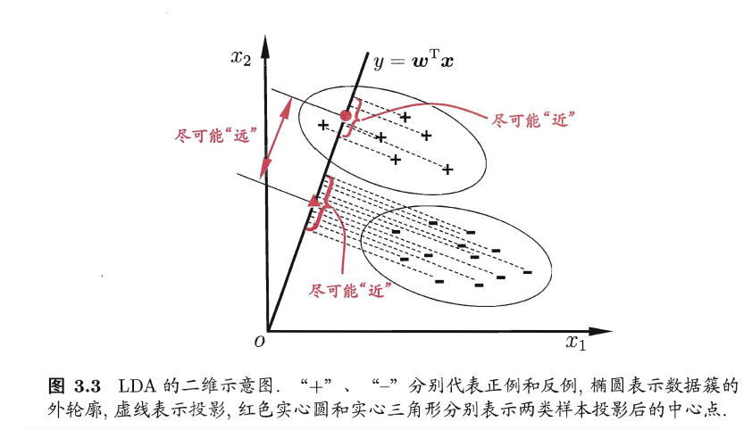

# 第3章 线性模型

# 基本形式

函数形式表示
$$
f(x) = w_1x_1 + w_2x_2 + ... + w_dx_d + b
$$

向量形式表示
$$
f(x) = w^Tx + b
$$
线性模型简单、易于建模，许多非线性模型都是在线性模型的基础上发展而来。由于*w*直观显示了各属性的重要性，因此线性模型有很好的**可解释性**（comprehensibility）。

## 线性回归

给定数据集
$$
D = \{(x_1,y_1),(x_2,y_2),...,(x_m,y_m)\}
$$
其中
$$
x_i = (x_{i1};x_{i2};...;x_{id}),y_i \in \mathbb{R}
$$
**线性回归**（linear regression）试图学得一个线性模型来尽可能准确地预测实值输出标记。

线性回归试图学得
$$
f(x_i) = wx_i + b,使得f(x_i) \simeq y_i
$$
那么如何确定$w$和$b$呢？关键在于衡量$f({x_i})$和$y_i$的差别。回归任务中常用的性能度量是**均方误差**，我们可以最小化均方误差
$$
\begin{aligned}\left(w^{*}, b^{*}\right) &=\underset{(w, b)}{\arg \min } \sum_{i=1}^{m}\left(f\left(x_{i}\right)-y_{i}\right)^{2} \\ &=\underset{(w, b)}{\arg \min } \sum_{i=1}^{m}\left(y_{i}-w x_{i}-b\right)^{2} \end{aligned}
$$
求解$w$和$b$使$E(w,b) = \sum_{i=1}^{m}(y_i - wx_i - b)^2$最小化的过程，称为线性回归的最小二乘“参数估计”（parameter estimation）。分别对$w$和$b$求导，即可得到关于$w$和$b$的最优解。

同理，**多元线性回归**（multivariate linear regression）则是相对与多个变量：
$$
f(x_i) = w^Tx_i + b,使得f(x_i) \simeq y_i
$$

## 对数几率回归（logistic regression）

怎么做分类任务？只需要用一个单调可微函数将分类任务的真实标记$y$与线性回归模型的预测值联系起来就能实现。

对于二分类问题，输出为$y \in  \{0,1\}$，可以使用阶跃函数（unit-step function）
$$
y=\left\{\begin{array}{cl}{0,} & {z<0} \\ {0.5,} & {z=0} \\ {1,} & {z>0}\end{array}\right.
$$
大于零为正例，小于零为反例，预测值为临界值零则可任意判别，如下图

可以看出，单位阶跃函数是不连续的，一般使用对数几率函数（亦称**Sigmoid**函数）来作为替代：
$$
y=\frac{1}{1+e^{-z}}
$$
因此，这样的模型也称作**对数几率回归**（logistic regression or logit regression）。

通过**梯度下降法**（gradient descent method）来求其最优解。

## 线性判别分析

**线性判别分析**（Linear Discriminant Analysis，LDA）是一种经典的线性学习方法，其思想是：给定训练样例，设法将样例投影到一条直线上，使得同类样例的投影点尽可能接近、异类样例的投影点尽可能远离，这样对于新的样例，将其投影到同样的这条直线上，根据其投影点的位置来确定其类别。如下图：

给定数据集$D=\left\{\left(\boldsymbol{x}_{i}, y_{i}\right)\right\}_{i=1}^{m}, y_{i} \in\{0,1\}$，其中$X_i$、$\mu_i$、$\sum_i$分别表示第$i \in \{0,1\}$类样本的集合、均值集合、协方差矩阵。如果投影到直线$\omega$上，那么，两类样本的中心在直线上的投影分别是$\omega^T\mu_0$和$\omega^T\mu_1$，两类样本在投影直线上的协方差分别是$\boldsymbol{w}^{\mathrm{T}} \boldsymbol{\Sigma}_{0} \boldsymbol{w}$和$\boldsymbol{w}^{\mathrm{T}} \boldsymbol{\Sigma}_{1} \boldsymbol{w}$。

要使同类样例的投影点尽可能接近，则同类样例投影点的协方差应尽可能小，即$\boldsymbol{w}^{\mathrm{T}} \boldsymbol{\Sigma}_{0} \boldsymbol{w}+\boldsymbol{w}^{\mathrm{T}} \boldsymbol{\Sigma}_{1} \boldsymbol{w}$尽可能小；要使异类样例投影点尽可能远，则可以让类中心点尽可能大，即$\left\|\boldsymbol{w}^{\mathrm{T}} \boldsymbol{\mu}_{0}-\boldsymbol{w}^{\mathrm{T}} \boldsymbol{\mu}_{1}\right\|_{2}^{2}$尽可能大。

