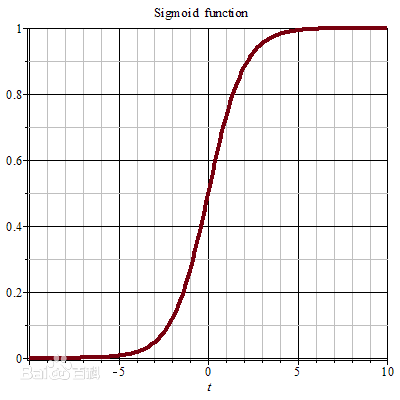

# 第5章 神经网络

## 前向传播与反向传播

## 不同的激活函数

激活函数的作用：将权值转化为分类结果。

### sigmoid函数

$$
S(x) = \frac{1}{1+e^{-x}}
$$

其曲线如图所示，能够将输出值映射到[0,1]内：

### softmax函数

softmax常用于多分类问题，把多个神经元输出值映射到（0,1），且总和为1。
$$
\sigma(\mathbf{z})_{j}=\frac{e^{z_{j}}}{\sum_{k=1}^{K} e^{z_{k}}}
$$

### tanh双曲正切

奇函数，值域在(-1,1)。
$$
\tanh x=\frac{\sinh x}{\cosh x}=\frac{e^{x}-e^{-x}}{e^{x}+e^{-x}}
$$
如图所示：

### ReLU函数

加快了训练速度，克服了梯度消失的问题
$$
f(x)=\max (0, x)
$$

## 其他常见的神经网络

* RBF径向基函数网络
* ART网络
* SOM网络
* 级联相关网络
* Elman网络
* Boltzmenn机

