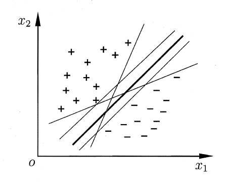
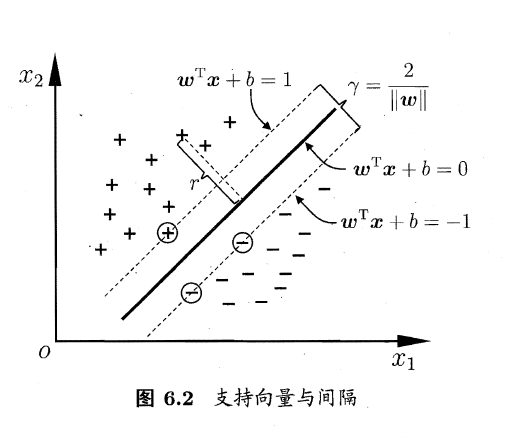
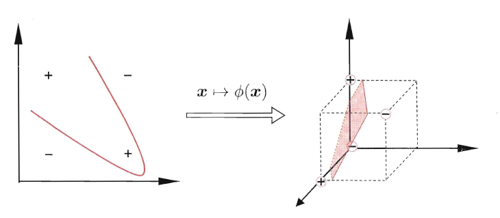
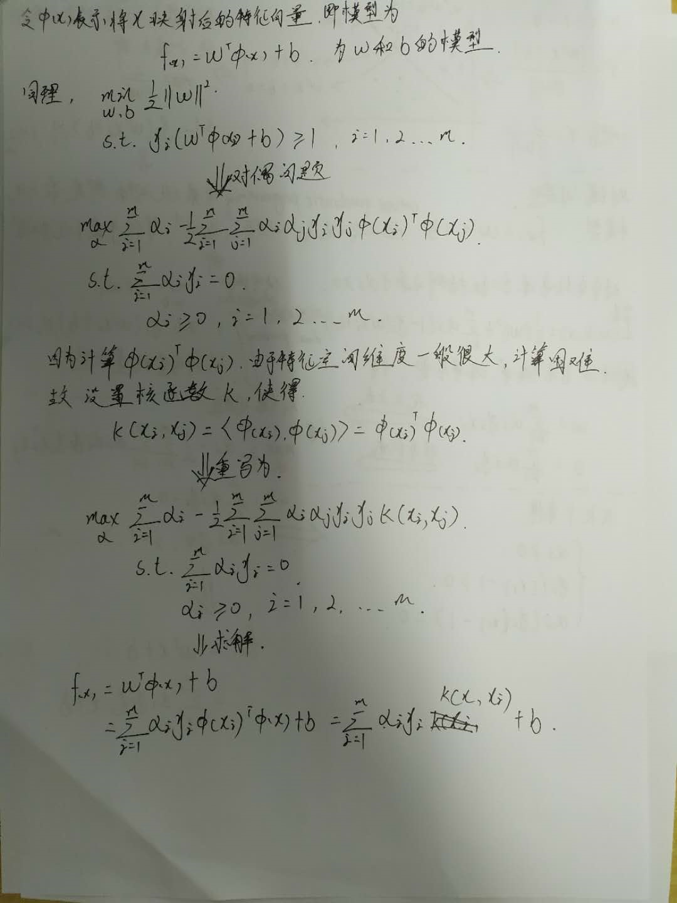
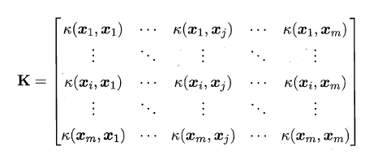
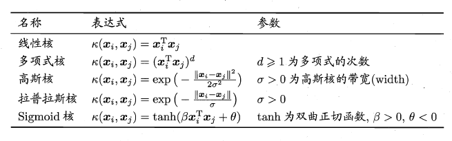
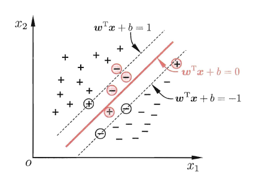
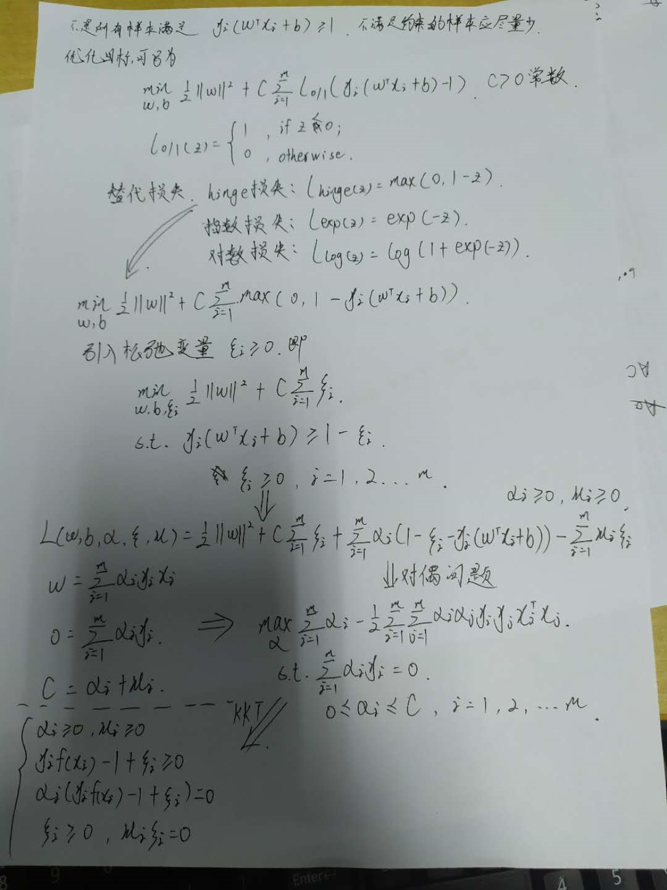
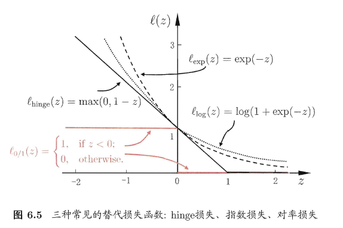

# 第6章 支持向量机

[TOC]

## 间隔与支持向量

给定训练样本集，分类学习最基本的想法就是基于训练集在样本空间找到一个划分超平面，将不同类别的样本分开。如图所示：

在样本空间中，划分超平面可通过如下线性方程描述：
$$
w^Tx + b = 0
$$
其中$w$是法向量，决定超平面的方向，$b$为位移项，决定超平面与远点之间的距离。样本任意点$x$到超平面的距离可写为：
$$
\
r=\frac{\left|\boldsymbol{w}^{\mathrm{T}} \boldsymbol{x}+b\right|}{\|\boldsymbol{w}\|}
$$
如果超平面能够正确分类，则有
$$
\left\{\begin{array}{ll}{\boldsymbol{w}^{\mathrm{T}} \boldsymbol{x}_{i}+b \geqslant+1,} & {y_{i}=+1} \\ {\boldsymbol{w}^{\mathrm{T}} \boldsymbol{x}_{i}+b \leqslant-1,} & {y_{i}=-1}\end{array}\right.
$$
如图，距离超平面最近的几个训练样本的使上式的等号成立，它们被称为**支持向量**（support vector），两个异类支持向量到超平面的距离之和为**间隔**（margin）。
$$
\gamma=\frac{2}{\|\boldsymbol{w}\|}
$$

我们项找到**最大间隔**来划分超平面

对于任意训练样本$(x_i,y_i)$，总有$\alpha_i = 0$或$y_if(x_i) = 1$。若$\alpha_i  = 0$，则样本不会在$f(x)$求和中出现，即不会对$f(x)$有影响；若$\alpha_i > 0$，则必有$y_if(x_i) = 1$ ，则该样本点位于最大间隔边界上，是一个支持向量。**支持向量机的重要性质：训练完成后，大部分的训练样本都不需保留，最终模型仅与支持向量有关。**

使用SMO（Sequential Minimal Optimization）算法对来求解这个二次规划问题。

## 核函数

现实任务中，原始样本空间内或许并不存在一个能正确划分两类样本的超平面，如图“异或”所示

对于这样的问题，可将样本从原始空间映射到一个高维的特征空间，使得样本在这个特征空间内线性可分。

**核函数**：令$X$为输入空间，$k(·，·)$是定义在$X * X$上的对称函数，则$k$是核函数当且仅当对于任意数据$D=｛x_1,x_2,...,x_m｝$，核函数$\textbf{K}$总是半正定的：

**核函数**的选择是支持向量机的最大变数。几种常用的核函数：

此外，还可以通过核函数组合得到。

## 软间隔与正则化

现实任务中很难确定合适的核函数是恶训练样本在特征空间中线性可分，即使找到了合适的核函数，也很难确定是不是出现了过拟合。为了缓解这个问题，提出了**软间隔**。如图所示：

前面介绍的支持向量机形式是眼球所有样本满足约束，即所有样本都必须划分正确，这称为硬间隔，软间隔则是允许某些样本不满足约束。

常见的三种替代损失函数。

正则化，结构风险+经验风险。

