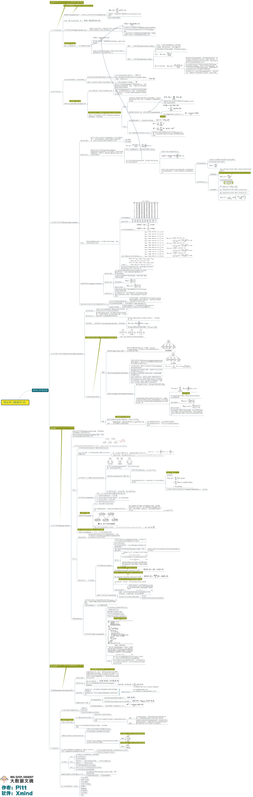

# 第7章 贝叶斯分类器

## 贝叶斯决策论

假设有$N$种可能的类别标记，即$\mathcal{Y} = {c_1,c_2,...c_N}$，$\lambda_{ij}$是将真实标记为$c_j$的样本误分类为$c_i$所产生的损失，可得到样本$\mathbf{x}$分类为$c_i$的期望损失
$$
R\left(c_{i} | \boldsymbol{x}\right)=\sum_{j=1}^{N} \lambda_{i j} P\left(c_{j} | \boldsymbol{x}\right)
$$
对于多分类问题，则是寻找一个判定准则$h$：$\mathcal{X} \mapsto \mathcal{Y}$来最小化总体风险
$$
R(h)=\mathbb{E}_{\boldsymbol{x}}[R(h(\boldsymbol{x}) | \boldsymbol{x})]
$$

$$
R(h)=\mathbb{E}_{\boldsymbol{x}}[R(h(\boldsymbol{x}) | \boldsymbol{x})]
$$

事实上，如果每个样本都能最小化风险，则总体风险也就会被最小化，这就产生了贝叶斯判定准则：为最小化总体风险，只需在每个样本上选择那个能使体哦案件风险最小的类别标记，即：
$$
h^{*}(\boldsymbol{x})=\underset{c \in \mathcal{Y}}{\arg \min } R(c | \boldsymbol{x})
$$
这里的$h^*$称为贝叶斯最优化分类器，相对应的总体风险称为贝叶斯风险。

最小化分类错误率的贝叶斯最有分类器为
$$
h^{*}(\boldsymbol{x})=\underset{c \in \mathcal{Y}}{\arg \max } P(c | \boldsymbol{x})
$$
要使用贝叶斯判定准则来最小化决策风险，首先要获得后验概率$P(c|x)$。有两种方法来解决这个问题，一种是判别式模型，直接对$P(c|x)$进行建模；另一种是生成模型，对联合概率分布$P(x|c)$建模，由此获得$P(c|x)$。基于贝叶斯定理：
$$
P(c | \boldsymbol{x})=\frac{P(c) P(\boldsymbol{x} | c)}{P(\boldsymbol{x})}
$$

## 朴素贝叶斯分类器

可以看出来，基于贝叶斯公式估计后验概率$P(c|x)$的主要困难在于：类条件概率$P(x|c)$是所有属性上的联合概率，难以从有限的训练样本中直接估计。所以，朴素贝叶斯分类器采用了“属性条件独立性假设”，**对于已知类别，假设所有属性相互独立**。基于这个假设，有
$$
P(c | \boldsymbol{x})=\frac{P(c) P(\boldsymbol{x} | c)}{P(\boldsymbol{x})}=\frac{P(c)}{P(\boldsymbol{x})} \prod_{i=1}^{d} P\left(x_{i} | c\right)
$$
对于所有类别来说$P(x)$相同，贝叶斯判定准则有
$$
h_{n b}(\boldsymbol{x})=\underset{c \in \mathcal{Y}}{\arg \max } P(c) \prod_{i=1}^{d} P\left(x_{i} | c\right)
$$
朴素贝叶斯分类器的训练过程就是基于训练集$D$来估计类先验概率$P(c)$，并为每个属性估计条件概率$P(x_i|c)$。类先验概率可以表示为：
$$
P(c)=\frac{\left|D_{c}\right|}{|D|}
$$
对于离散的属性来说，条件概率可以估计为：
$$
P\left(x_{i} | c\right)=\frac{\left|D_{c, x_{i}}\right|}{\left|D_{c}\right|}
$$
对于连续的属性则可以考虑概率密度函数：
$$
p\left(x_{i} | c\right)=\frac{1}{\sqrt{2 \pi} \sigma_{c, i}} \exp \left(-\frac{\left(x_{i}-\mu_{c, i}\right)^{2}}{2 \sigma_{c, i}^{2}}\right)
$$
为了避免其他属性携带的信息被训练集中未出现的属性值“抹去”，在估计概率值时通常要进行**smooothing**，常用拉普拉斯修正。

