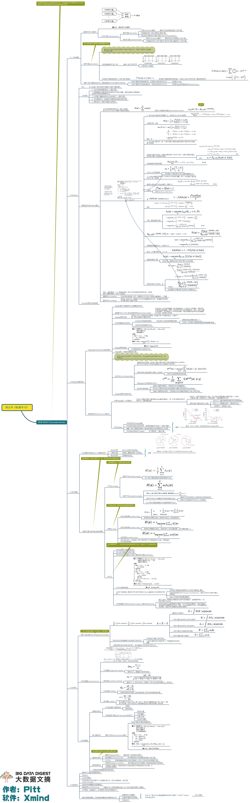
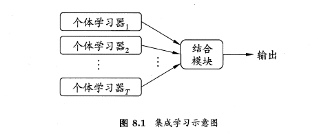
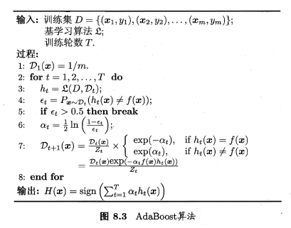

# 第8章 集成学习

> 集成学习，通过构建并结合多个学习器来完成学习任务，有时也被称为多分类器系统、基于委员会的学习等。
>
> 一般结构：先产生一组“个体学习器”，再用某种策略将它们结合起来。
>
> 同质集成中的个体学习器亦称“基学习器”，相应的学习算法称为“基学习算法”。
>
> 异质集成中的个体学习器由不同的学习算法生成，这是就不再有基学习算法，相应的个体学习器一般称为“组件学习器”。

**弱学习器**：指泛化性能略由于随机猜测的学习器；例如在二分类问题上精度略高于50%的分类器。

集成学习的个体学习器应“好而不同”，即个体学习器应有一定的“准确性”，并且学习器之间应有差异。

针对二分类问题，假设$T$为奇数，$y \in \{-1,+1\}$假设集成通过简单投票法结合$T$个基分类器，若超过半数的基分类器正确，即正确：
$$
H(\boldsymbol{x})=\operatorname{sign}\left(\sum_{i=1}^{T} h_{i}(\boldsymbol{x})\right)
$$
其中假定基分类器的错误率为$\epsilon$，即对每个基分类器$h_i$有
$$
P\left(h_{i}(\boldsymbol{x}) \neq f(\boldsymbol{x})\right)=\epsilon
$$
设基本类器的错误率相互独立，集成的错误率为
$$
\begin{aligned} P(H(\boldsymbol{x}) \neq f(\boldsymbol{x})) &=\sum_{k=0}^{\lfloor T / 2\rfloor}\left(\begin{array}{c}{T} \\ {k}\end{array}\right)(1-\epsilon)^{k} \epsilon^{T-k} \\ & \leqslant \exp \left(-\frac{1}{2} T(1-2 \epsilon)^{2}\right) \end{aligned}
$$
随着个体分类器数目$T$的增大，集成的错误率会指数级下降。

> 目前的集成学习方法大致分为两大类，即个体学习器间存在强依赖关系、必须串行生成的序列化方法，以及个体学习器间不存在强依赖关系、可同时生成的并行化方法；前者的代表是Boosting，后者的代表是Bagging和Random Forest。

## Boosting

Boosting是一族可将弱学习器提升为强学习器的算法。这族算法的工作机制类似：先从初始训练集训练出一个基学习器，再根据基学习器的表现对训练样本分布进行调整，使得先前基学习器做错的训练样本在后续受到更多关注，然后基于调整后的样本分布训练下一个基学习器。

Boosting族算法最著名的代表是AdaBoost，算法如下：

其中$y_{i} \in\{-1,+1\}$，$f$是真实函数，AdaBoost算法有多种推导方式，，基于“加性模型”，即基学习器的线性组合
$$
H(\boldsymbol{x})=\sum_{t=1}^{T} \alpha_{t} h_{t}(\boldsymbol{x})
$$
来最小化指数损失函数
$$
\ell_{\exp }(H | \mathcal{D})=\mathbb{E}_{\boldsymbol{x} \sim \mathcal{D}}\left[e^{-f(\boldsymbol{x}) H(\boldsymbol{x})}\right]
$$

