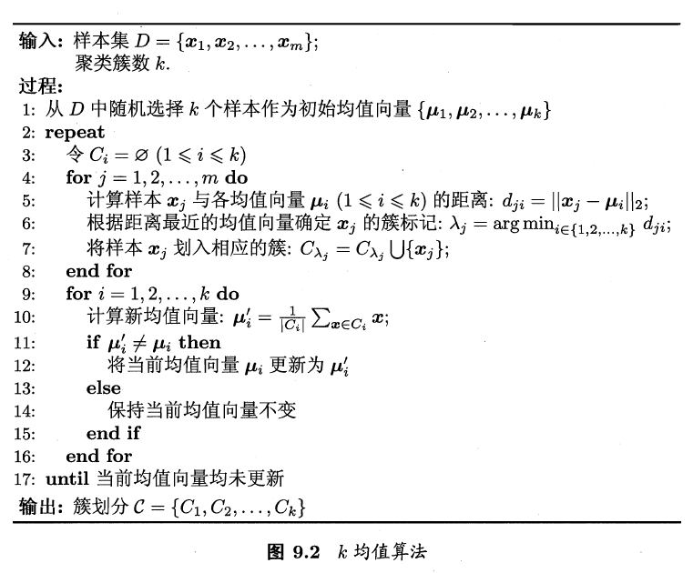

# 第9章 聚类

## 聚类任务

无监督学习中，训练样本的标记信息是未知的，要通过这些无标记训练样本的学习来揭示数据的内在性质及规律，为进一步的数据分析提供基础。这种学习任务称为**聚类**。

聚类试图将数据集中的样本划分为若干个不相交的子集，每个子集称为一个簇。

## 性能度量

聚类性能度量亦称聚类“有效性指标”。

聚类性能度量大致有两类。一类是将聚类结果与某个“参考模型”进行比较，称为外部指标；另一类是直接考察聚类结果而不利用任何参考模型，称为内部指标。

聚类性能度量外部指标：

* Jaccard系数，简称JC
  $$
  J C=\frac{a}{a+b+c}
  $$

* FM指标，简称FMI
  $$
  \mathrm{FMI}=\sqrt{\frac{a}{a+b} \cdot \frac{a}{a+c}}
  $$

* Rand指数，简称RI

$$
\mathrm{RI}=\frac{2(a+d)}{m(m-1)}
$$

上述性能度量的结果值均在$[0,1]$之间，值越大越好。

常用的聚类性能度量内部指标：

* DB指数，简称DBI
  $$
  \mathrm{DBI}=\frac{1}{k} \sum_{i=1}^{k} \max _{j \neq i}\left(\frac{\operatorname{avg}\left(C_{i}\right)+\operatorname{avg}\left(C_{j}\right)}{d_{\operatorname{cen}}\left(\boldsymbol{\mu}_{i}, \boldsymbol{\mu}_{j}\right)}\right)
  $$

* Dunn指数，简称DI
  $$
  \mathrm{DI}=\min _{1 \leqslant i \leqslant k}\left\{\min _{j \neq i}\left(\frac{d_{\min }\left(C_{i}, C_{j}\right)}{\max _{1 \leqslant l \leqslant k} \operatorname{diam}\left(C_{l}\right)}\right)\right\}
  $$

显然，DBI越小越好，DI则相反，值越大越好。

## 距离计算

一个**距离度量**需要满足以下基本性质：

* 非负性，$\operatorname{dist}\left(\boldsymbol{x}_{i}, \boldsymbol{x}_{j}\right) \geqslant 0$
* 同一性，$\operatorname{dist}\left(\boldsymbol{x}_{i}, \boldsymbol{x}_{j}\right)=0当且仅当x_i=x_j$
* 对程性，$\operatorname{dist}\left(\boldsymbol{x}_{i}, \boldsymbol{x}_{j}\right)=\operatorname{dist}\left(\boldsymbol{x}_{j}, \boldsymbol{x}_{i}\right)$
* 直递性，$\operatorname{dist}\left(\boldsymbol{x}_{i}, \boldsymbol{x}_{j}\right) \leqslant \operatorname{dist}\left(\boldsymbol{x}_{i}, \boldsymbol{x}_{k}\right)+\operatorname{dist}\left(\boldsymbol{x}_{k}, \boldsymbol{x}_{j}\right)$

最常用的是"闵可夫斯基距离”
$$
\operatorname{dist}_{\mathrm{mk}}\left(\boldsymbol{x}_{i}, \boldsymbol{x}_{j}\right)=\left(\sum_{u=1}^{n}\left|x_{i u}-x_{j u}\right|^{p}\right)^{\frac{1}{p}}
$$
当$p=2$时，闵可夫斯基距离即欧氏距离
$$
\operatorname{disted}\left(\boldsymbol{x}_{i}, \boldsymbol{x}_{j}\right)=\left\|\boldsymbol{x}_{i}-\boldsymbol{x}_{j}\right\|_{2}=\sqrt{\sum_{u=1}^{n}\left|x_{i u}-x_{j u}\right|^{2}}
$$
当$p=1$时，闵可夫斯基距离即曼哈顿距离
$$
\operatorname{dist}_{\operatorname{man}}\left(\boldsymbol{x}_{i}, \boldsymbol{x}_{j}\right)=\left\|\boldsymbol{x}_{i}-\boldsymbol{x}_{j}\right\|_{1}=\sum_{u=1}^{n}\left|x_{i u}-x_{j u}\right|
$$
对于不能直接在属性值上计算距离的称为无序属性，显然，闵可夫斯基距离可用于有序属性。

对于无序属性可采用VDM计算。令$m_{u,a}$表示在属性$u$上取值为$a$的样本数，$m_{u,a,i}$表示在第$i$个样本簇中在属性$u$上取值为$a$的样本数，$k$为样本簇数，则属性$u$上的两个离散值$a$与$b$之间的VDM距离为：
$$
\operatorname{VDM}_{p}(a, b)=\sum_{i=1}^{k}\left|\frac{m_{u, a, i}}{m_{u, a}}-\frac{m_{u, b, i}}{m_{u, b}}\right|^{p}
$$
于是，将闵可夫斯基距离和VDM结合即可处理混合属性。
$$
\operatorname{MinkovDM}_{p}\left(\boldsymbol{x}_{i}, \boldsymbol{x}_{j}\right)=\left(\sum_{u=1}^{n_{c}}\left|x_{i u}-x_{j u}\right|^{p}+\sum_{u=n_{\mathrm{c}}+1}^{n} \operatorname{VDM}_{p}\left(x_{i u}, x_{j u}\right)\right)^{\frac{1}{p}}
$$
当样本空间中不同属性的重要性不同时，可使用“加权距离”，以加权闵可夫斯基距离为例：
$$
\operatorname{dist}_{\mathrm{wmk}}\left(\boldsymbol{x}_{i}, \boldsymbol{x}_{j}\right)=\left(w_{1} \cdot\left|x_{i 1}-x_{j 1}\right|^{p}+\ldots+w_{n} \cdot\left|x_{i n}-x_{j n}\right|^{p}\right)^{\frac{1}{p}}
$$

> 需要注意的是，通常我们是基于某种形式的距离来定义“相似度度量”，距离越大，相似度越小。

## 原型聚类

### $k$均值算法

给定样本集$D=\left\{\boldsymbol{x}_{1}, \boldsymbol{x}_{2}, \ldots, \boldsymbol{x}_{m}\right\}$，"$k$均值"（$k-means$）算法针对聚类所得簇划分$\mathcal{C}=\left\{C_{1}, C_{2}, \ldots, C_{k}\right\}$最小化平方误差：
$$
E=\sum_{i=1}^{k} \sum_{\boldsymbol{x} \in C_{i}}\left\|\boldsymbol{x}-\boldsymbol{\mu}_{i}\right\|_{2}^{2}
$$
其中$\boldsymbol{\mu}_{i}=\frac{1}{\left|C_{i}\right|} \sum_{\boldsymbol{x} \in C_{i}} \boldsymbol{x}$是簇$C_i$的均值向量。

### 学习向量量化

与$k$均值算法类似，"学习向量量化" (Learning Vector Quantization，简称$LVQ$)也是试图找到一组原型向量来刻画聚类结构， 但与一般聚类算法不同的是， $LVQ$假设数据样本带有类别标记，学习过程利用样本的这些监督信息来辅助聚类。

### 高斯混合聚类

高斯混合聚类采用概率模型来表达聚类原型。

定义高斯混合分布为
$$
p_{\mathcal{M}}(\boldsymbol{x})=\sum_{i=1}^{k} \alpha_{i} \cdot p\left(\boldsymbol{x} | \boldsymbol{\mu}_{i}, \mathbf{\Sigma}_{i}\right)
$$

## 密度聚类

密度聚类亦称基于密度的聚类，此类算法假设聚类结构能通过样本分布的紧密程度确定。密度聚类算法从样本密度的角度来考察样本之间的可连接性，并基于可连接样本不断扩展聚类簇以获得最终的聚类结果。

$DBSCAN$是一种著名的密度聚类算法。

## 层次聚类

层次聚类(hierarchical clustering)试图在不同层次对数据集进行划分，从而形成树形的聚类结构. 数据集的划分可采用"自底向上"的聚合策略，也可采用"自顶向下" 的分拆策略。

$AGNES$是一种采用自底向上聚类策略的层次聚类算法。

